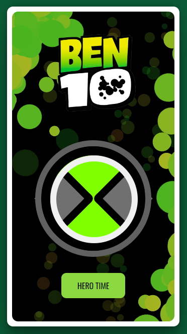
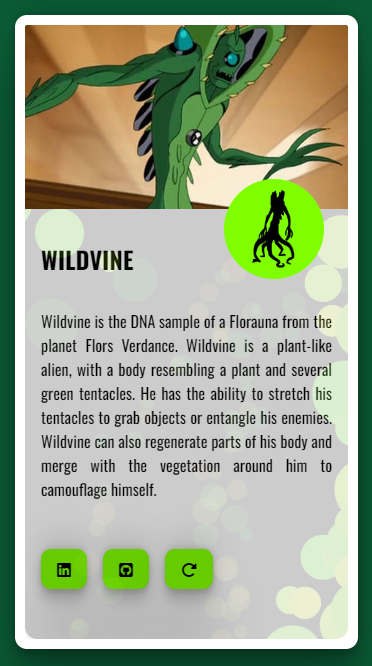

You can read this document in Portuguese by clicking [here](./README.md)

  

## Ben 10 Alien Randomizer

This project is a randomization application inspired by the aliens from the animated series Ben 10. It allows users to randomly select an alien character from the series and provides information about the selected alien. The main objective was to practice my web development skills, including HTML, CSS and JavaScript.

### Try It Out:

[https://filipelimavaz-ben10.netlify.app](https://filipelimavaz-instagramclone.netlify.app/)

## Tecnologies

- HTML
- CSS
- JavaScript

### Features:

- **Random Alien Selection**: Users can click the "Random" button to randomly select an alien from the Ben 10 series.
- **Alien Information**: Once an alien is selected, the tool provides information about the chosen alien, including its name and description.
- **Interactive Interface**: The interface dynamically updates to display information and the background image of the selected alien.

## Responsiveness:
The application is responsive for both computers and the vast majority of mobile devices.

### How It Works:

The tool uses JavaScript to fetch a list of aliens from a JSON database. When the "Random" button is clicked, it randomly selects an alien from the list and displays its corresponding image. Then, the tool retrieves additional information about the selected alien from the database and presents it to the user.

### Technologies Used:

- **HTML/CSS/JavaScript**: The project is built using standard web technologies for frontend interface and interactivity.
- **JSON Database**: Alien data is stored in JSON format, allowing easy retrieval and manipulation.
- **XMLHttpRequest (XHR)**: XHR is used to asynchronously fetch data from the JSON database.

## Screenshots

Some screenshots from the mobile version:

| Screen 1 | Screen 2 |
|----------|----------|
|  |  |

### Developer:

This project was developed by [Filipe de Lima Vaz](https://www.linkedin.com/in/filipe-de-lima-vaz/). Feel free to check out the GitHub repository for more details and contributions.
